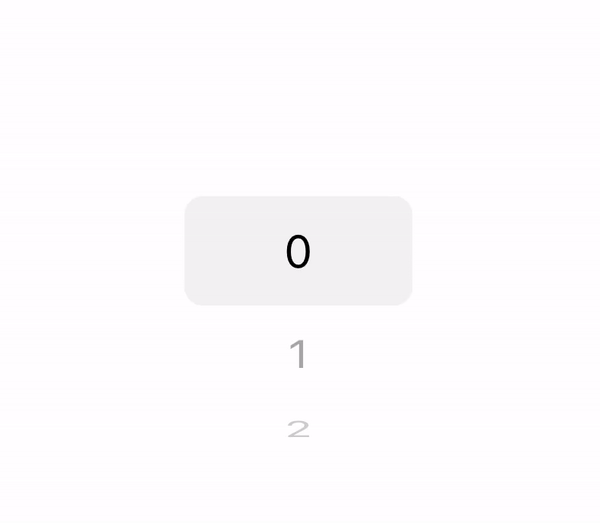
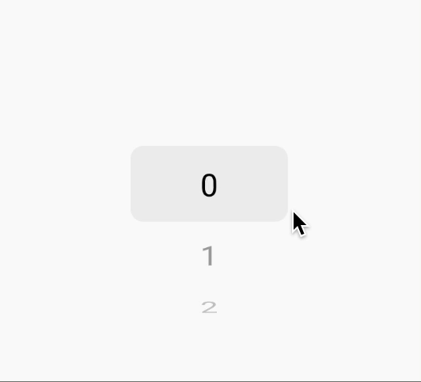

[AUTHOR]: https://github.com/rozhkovs
[FEEDBACK_GITHUB]: https://github.com/quidone/react-native-wheel-picker-feedback
[EXPO_SNACK]: https://snack.expo.dev/@sergeyrozhkov/quidone-react-native-wheel-picker

# React Native Wheel Picker
<p>
  <a href="https://github.com/quidone/react-native-wheel-picker/blob/HEAD/LICENSE">
    
  </a>
  <a href="https://github.com/quidone/react-native-wheel-picker/actions/workflows/tests.yml">
    
  </a>
  <a href="https://www.npmjs.com/package/@quidone/react-native-wheel-picker">
    
  </a>
  <a href="https://www.npmjs.com/package/@quidone/react-native-wheel-picker">
    
  </a>
</p>

A flexible React Native Wheel Picker for iOS and Android without using the native side.

<table>
  <tr>
    <td align="center">
      
      <br />
      On iOS
    </td>
    <td align="center">
      
      <br />
      On Android
    </td>
    <td align="center">
      
      <br />
      Customization
    </td>
  </tr>
</table>


## Features
- Without native side.
- Unified API.
- Only native animations.
- [Support native feedback](#Native-Feedback).
- [Support virtualization](#withVirtualized).
- Compatible with Expo ([Snack][EXPO_SNACK]).
- Deep customization
- Written ```TypeScript```.

## Installation
```shell
yarn add @quidone/react-native-wheel-picker
```

## Navigation

- [Usage](#Usage)
- [Native Feedback](#Native-Feedback)
- [API](#API)
  - [WheelPicker](#WheelPicker)
    - [usePickerItemHeight](#usePickerItemHeight)
    - [useScrollContentOffset](#useScrollContentOffset)
    - [withVirtualized](#withVirtualized)
  - [DatePicker (Beta)](#DatePicker)
  - [Picker Control (Beta)](#Picker-Control)
    - [usePickerControl](#usePickerControl)
    - [withPickerControl](#withPickerControl)
    - [useOnPickerValueChangedEffect](#useOnPickerValueChangedEffect)
    - [useOnPickerValueChangingEffect](#useOnPickerValueChangingEffect)
- [Footer](#-Author)

## Usage

### [🚀 Expo Snack example][EXPO_SNACK]

If you want to see more examples and experiment, run the examples locally.

```shell
git clone git@github.com:quidone/react-native-wheel-picker.git
cd react-native-wheel-picker
yarn install
cd example && yarn install && yarn ios
```

### WheelPicker usage

```jsx
import React, {useState} from 'react';
import WheelPicker from '@quidone/react-native-wheel-picker';

const data = [...Array(100).keys()].map((index) => ({
  value: index,
  label: index.toString(),
}))

const App = () => {
  const [value, setValue] = useState(0);
  return (
    <WheelPicker
      data={data}
      value={value}
      onValueChanged={({item: {value}}) => setValue(value)}
      enableScrollByTapOnItem={true}
    />
  );
};

export default App;
```

### DatePicker usage (Beta)
> ⚠️ **Warning:** It is recommended to test the component in a release build of your application.
> There is an issue where synchronization of scrolling may occasionally slip during scrolling
> attempts when performance is low.

#### Simple case
```tsx
import React, {useState} from 'react';
import {DatePicker} from '@quidone/react-native-wheel-picker';

const App = () => {
  const [date, setDate] = useState('2025-02-02');

  return (
    <DatePicker
      date={date} // required format YYYY-MM-DD
      onDateChanged={({date}) => setDate(date)}
    />
  );
};
```

#### Customized case
You also have a lot of control over each WheelPicker and the rendering process;
you can add your own components between individual WheelPickers

```tsx
import React, {useState} from 'react';
import {useStableCallback} from '@rozhkov/react-useful-hooks';
import {DatePicker} from '@quidone/react-native-wheel-picker';

const CustomizedDatePicker = () => {
  const [date, setDate] = useState('2025-02-02');

  const onDateChanged = useStableCallback(({date}: {date: string}) => {
    setDate(date);
  });

  return (
    <DatePicker
      date={date}
      onDateChanged={onDateChanged}
      renderDate={() => <DatePicker.Date />}
      renderMonth={() => <DatePicker.Month />}
      renderYear={() => <DatePicker.Year />}
    >
      {({dateNodes}) => {
        return dateNodes.map((x) => x.node);
      }}
    </DatePicker>
  );
};
```

### PickerControl usage (Beta)

```tsx
import React, {useState} from 'react';
import WheelPicker, {
  type PickerItem,
  useOnPickerValueChangedEffect,
  useOnPickerValueChangingEffect,
  usePickerControl,
  withPickerControl,
} from '@quidone/react-native-wheel-picker';
import {View} from 'react-native';

const ControlPicker = withPickerControl(WheelPicker);

type ControlPickersMap = {
  value1: {item: PickerItem<number>};
  value2: {item: PickerItem<number>};
};

const data = Array.from({length: 100}, (_, index) => ({value: index}));

const App = () => {
  const [value, setValue] = useState({value1: 0, value2: 0});

  const pickerControl = usePickerControl<ControlPickersMap>();

  useOnPickerValueChangedEffect(pickerControl, (event) => {
    setValue({
      value1: event.pickers.value1.item.value,
      value2: event.pickers.value2.item.value,
    });
  });

  useOnPickerValueChangingEffect(pickerControl, (event) => {
    // some logic
  });

  return (
    <View style={{flexDirection: 'row', justifyContent: 'space-around'}}>
      <ControlPicker
        control={pickerControl}
        pickerName={'value1'}
        data={data}
        value={value.value1}
        width={100}
        enableScrollByTapOnItem={true}
      />
      <ControlPicker
        control={pickerControl}
        pickerName={'value2'}
        data={data}
        value={value.value2}
        width={100}
        enableScrollByTapOnItem={true}
      />
    </View>
  );
};
```


## Native Feedback

You can trigger native sound and impact with [@quidone/react-native-wheel-picker-feedback][FEEDBACK_GITHUB]
and onValueChanging event

```jsx
// ...
import WheelPickerFeedback from '@quidone/react-native-wheel-picker-feedback';

const App = () => {
  return (
    <WheelPicker
      onValueChanging={() => {
        WheelPickerFeedback.triggerSoundAndImpact();
      }}
    />
  );
};
```

## API

### WheelPicker

#### Props
- ```data``` [array] - items of picker
- ```value?``` [any] - current value of picker item
- ```itemHeight?``` [number] - height of picker item in the center.
- ```visibleItemCount?``` [number] - number of displayed items: 1, 3, 5... (default = 5). For 5, the WheelPicker height is calculated incorrectly, left for backward compatibility.
- ```width?``` [number | string] - width of picker.
- ```readOnly?``` [boolean] - read only mode.
- ```enableScrollByTapOnItem?``` [boolean] - allow scrolling by tap on an item (default = false)
- ```extraValues?``` [unknown[]] - external values on which the Picker depends. Can be used as a forced trigger for scroll synchronization, even if it is active
- ```testID?``` [string] - Used to locate this component in end-to-end tests.
- ```onValueChanging?``` [function] - An event that is triggered when the value is changing.
- ```onValueChanged?``` [function] - An event that is triggered when the value is changed (wheel is stopped and no touch).
- ```keyExtractor?``` [function] - key extractor from picker item.
- ```renderItem?``` [function] - render picker item content.
- ```renderItemContainer?``` [function] - render picker item container (there is animated container).
- ```renderOverlay?``` [function | null] - render overlay over the picker.
- ```renderList?``` [function] - render list (Advanced, It is not recommended to use).
- ```style?``` [object | array] - root style.
- ```itemTextStyle?``` [object | array] - item text style for picker item.
- ```overlayItemStyle?``` [object | array] - style for the overlay element in the center
- ```contentContainerStyle?``` [object | array] - style which wraps all of the child views [original](https://reactnative.dev/docs/scrollview#contentcontainerstyle)
- ```scrollEventThrottle?``` [object | array] - [original](https://reactnative.dev/docs/scrollview#scrolleventthrottle-ios)


#### usePickerItemHeight
This hook returns the item height which was passed via props.

#### useScrollContentOffset
This hook returns the animated value of the ScrollView offset.

#### withVirtualized
This HOC returns virtualized picker

```jsx
import WheelPicker, {withVirtualized} from '@quidone/react-native-wheel-picker';

const VirtualizedWheelPicker = withVirtualized(WheelPicker);
```

#### Additional props
- ```initialNumToRender?``` (default = ```Math.ceil(visibleItemCount / 2)```) - [original](https://reactnative.dev/docs/flatlist#initialnumtorender).
- ```maxToRenderPerBatch?``` (default = ```Math.ceil(visibleItemCount / 2)```) - [original](https://reactnative.dev/docs/flatlist#maxtorenderperbatch).
- ```windowSize?``` - [original](https://reactnative.dev/docs/flatlist#windowsize).
- ```updateCellsBatchingPeriod?``` (default = 10) - [original](https://reactnative.dev/docs/flatlist#updatecellsbatchingperiod).

### DatePicker

A specialized picker component for selecting dates. It supports localization and deep customization.

#### Props
- ```date``` [string] - Current date in 'YYYY-MM-DD' format
- ```onDateChanged``` [function] - Callback fired when date selection is confirmed
- ```minDate?``` [string] - Minimum selectable date in 'YYYY-MM-DD' format
- ```maxDate?``` [string] - Maximum selectable date in 'YYYY-MM-DD' format
- ```locale?``` [string] - Locale for date formatting (default = 'en')
- ```renderDate?``` [function] - Custom renderer for date component
- ```renderMonth?``` [function] - Custom renderer for month component
- ```renderYear?``` [function] - Custom renderer for year component
- ```children?``` [function] - Render prop for customizing component layout

DatePicker also accepts all the common wheel picker props like `itemHeight`, `visibleItemCount`, `readOnly`, etc.

#### Subcomponents
DatePicker exposes subcomponents that can be used for custom layouts:
- ```DatePicker.Date``` - Day WheelPicker
- ```DatePicker.Month``` - Month WheelPicker
- ```DatePicker.Year``` - Year WheelPicker

### Picker Control

Picker Control provides a way to synchronize multiple WheelPicker components. It is used inside DatePicker.

Main goals:
1. Synchronize onValueChanged and onValueChanging events.
2. Synchronize the value selection process. If a value changes, all WheelPickers should accept this value, even if they are still spinning.

#### usePickerControl

A hook that creates a control object for connecting multiple pickers. See [example](#PickerControl-Usage-Beta)

#### withPickerControl

A HOC that connects a WheelPicker to a control object. See [example](#PickerControl-Usage-Beta)

##### Adding props
- ```control``` [object] - Control object created with `usePickerControl`
- ```pickerName``` [string] - Unique name for the picker within the control group

#### useOnPickerValueChangedEffect

Called when the value has been changed. This occurs during the inactive state of all WheelPickers. See [example](#PickerControl-Usage-Beta)

#### useOnPickerValueChangingEffect

Called when any of the connected WheelPickers changes. See [example](#PickerControl-Usage-Beta)


## 👨‍💻 Author
[Sergey Rozhkov][AUTHOR]

## 🎯 Was it helpful?
Do you like it and find it helpful? You can help this project in the following way:
- ⭐ Put the star.
- 💡 Suggest your ideas.
- 😉 Open a founded issue.

## 🤝 Contributing
See the [contributing guide](CONTRIBUTING.md) to learn how to contribute to the repository and the development workflow.

## 📄 License
Quidone React Native Wheel Picker is MIT licensed, as found in the [LICENSE](LICENSE) file.

---

Made with [create-react-native-library](https://github.com/callstack/react-native-builder-bob)
